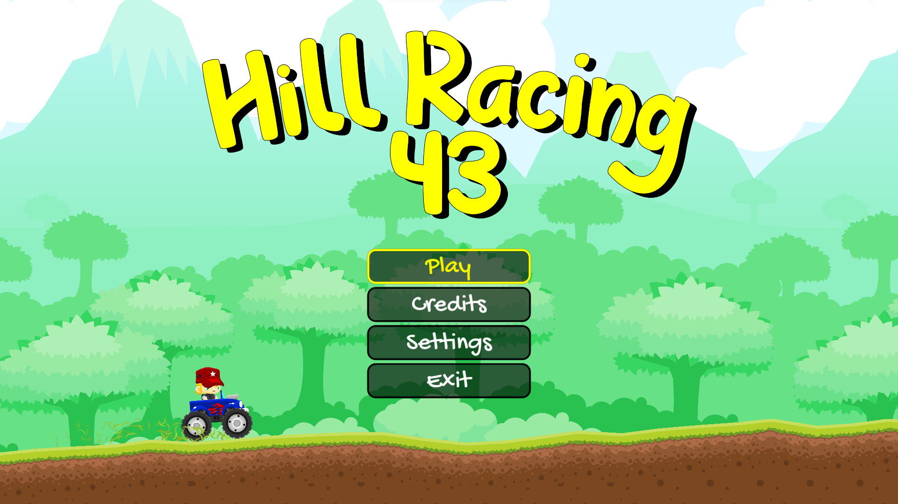
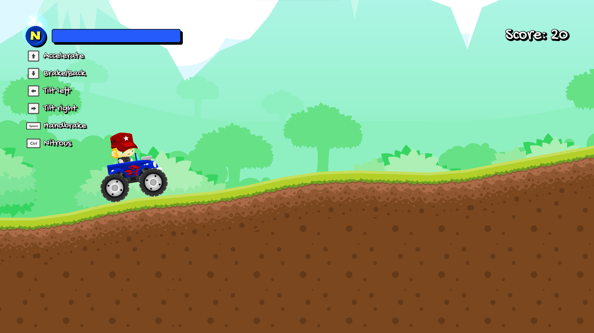
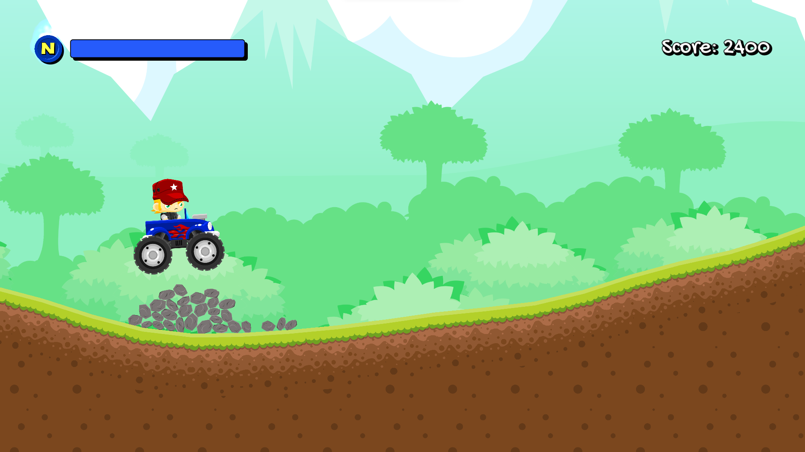
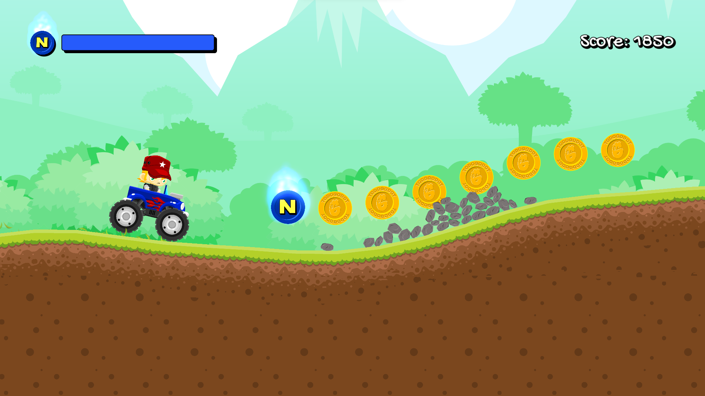

# Hill Escapades Pro

A hand-crafted 2D hill-racing game built in **Godot 4.6**, focused on pure gameplay feel, elegant design, and secure local data handling.

No AI features. No cloud dependencies. Just you and the hills.

---

## Gameplay

Drive your vehicle across procedurally generated terrain, pulling off jumps, backflips, and collecting coins to upgrade your rig. Every run is different — the terrain is seeded fresh each time.

- **Throttle / Brake** — Arrow keys or W / S
- **Tilt in air** — A / D (left / right)
- **Nitro** — Shift
- **Pause** — Escape

---

## Features

- Infinite procedural terrain with noise-based hills, rocks, and landmarks
- Physics-driven car with pin-jointed wheels, suspension, and upgrade system
- Upgrade shop — Engine, Suspension, Tires, Nitro capacity
- Local leaderboard (SQLite, stored on-device)
- Score system: distance + coins + air time + backflips + medals
- Smooth HUD with animated fuel / nitro bars and speed readout
- Camera shake, dust particles, grass particles, engine audio
- Fully localised (English / Spanish)

---

## Built With

- [Godot Engine 4.6](https://godotengine.org/)
- [GDSQLite](https://github.com/2shady4u/godot-sqlite) — local score storage

---

## Screenshots






---

## Project Structure

```
scenes/      — Car, terrain, game logic, globals
gui/         — HUD, menus, game over, pause, settings
items/       — Collectibles (coins, fuel, nitro, medals)
assets/      — Sprites, fonts, sounds
particles/   — Visual effects
translations/ — Localisation files
addons/      — GDSQLite extension
```

---

© 2026 itskenzzoo. All rights reserved.
